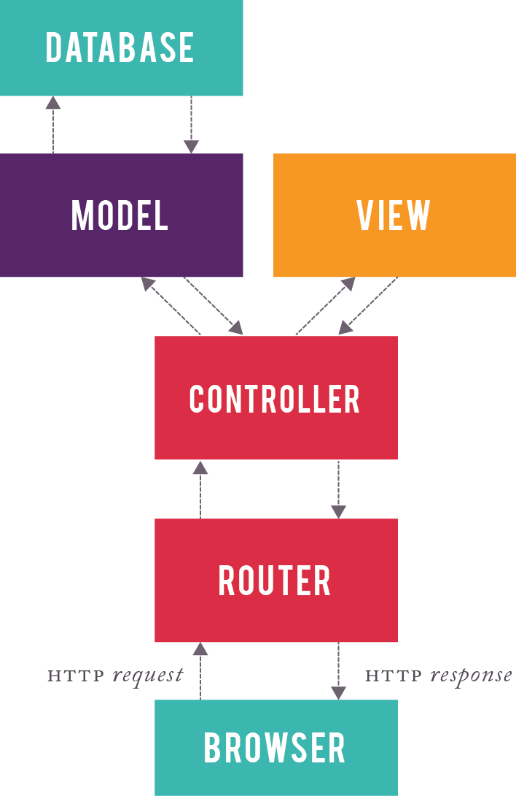

# Compass Notes
*Jan 10th, 2022*
## Ruby's MVC - Model View Controller
  * Model => DB => ActiveRecord
  * View => ERB Templates
  * Controller = > Project Manager

## Design or Architectural pattern

* Another term for router is dispatcher
* Router decides one controller for request
## Controllers
For example, the Products controller uses the model to fetch data for the view to render. By conventions, The controller knows where the views file is located and to automatically write it without using `render: index`
```ruby
class ProductsController < ApplicationController
  def index
    #uses MODEL
    @products = Product.all.order(created_at: : desc)
    # render's view, (not written, explicit)
    render :index
  end
end
```
  